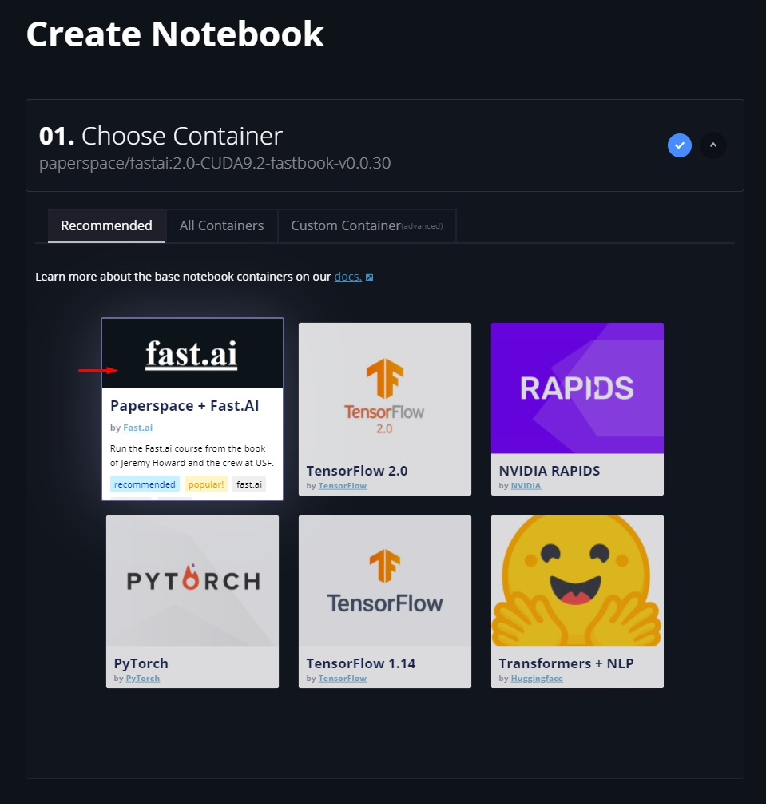
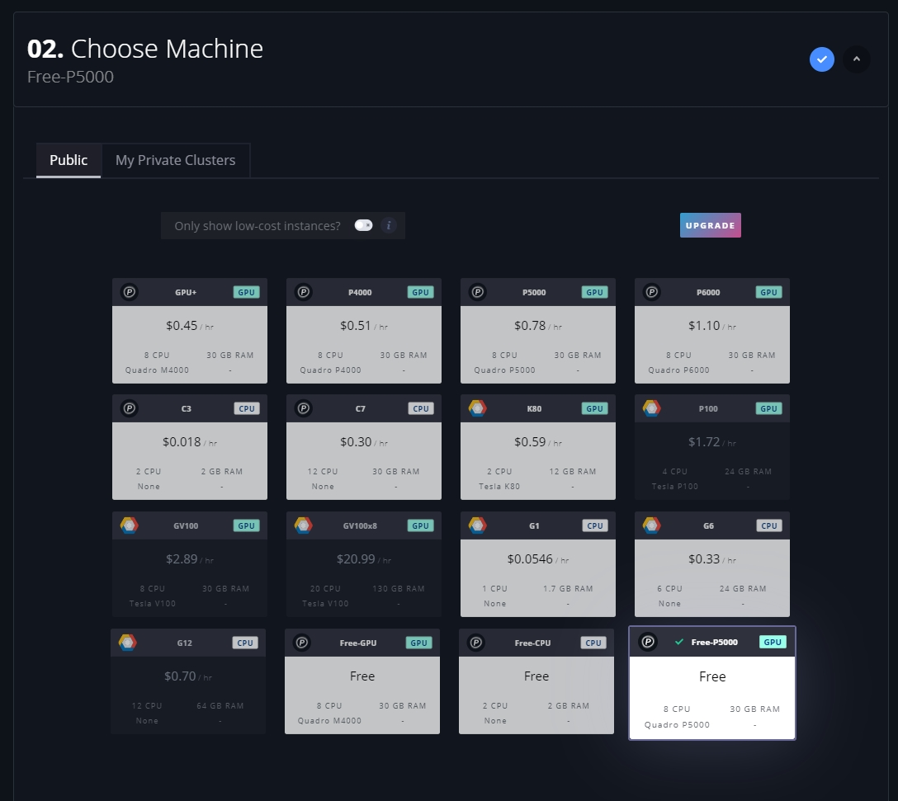
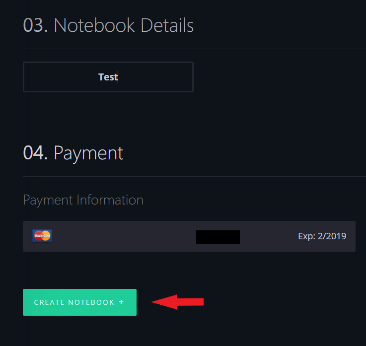
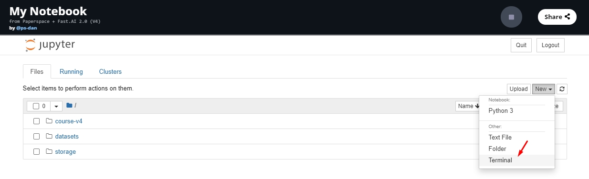
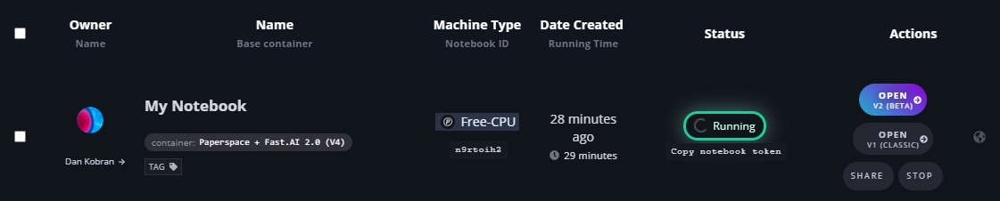
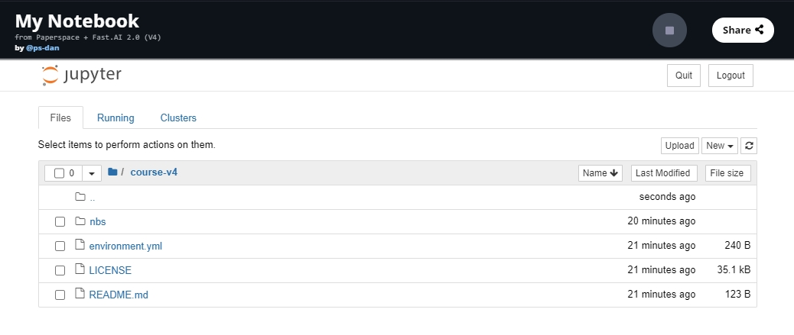
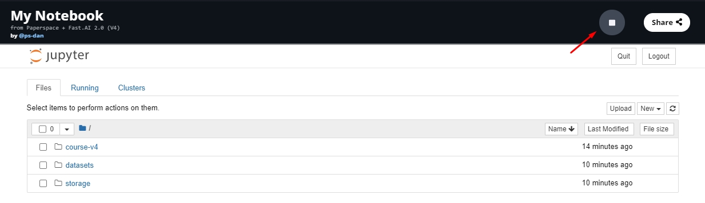
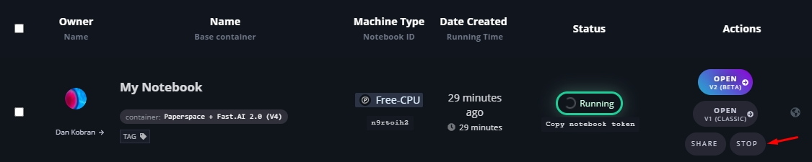
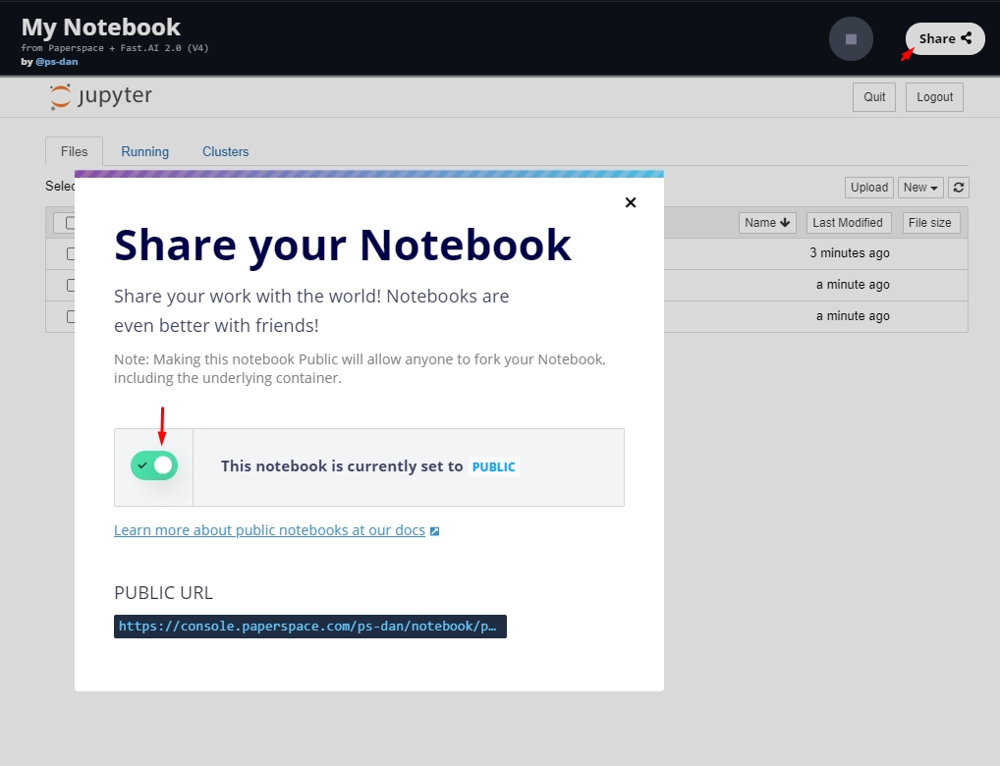

本ページでは、「PyTorchとfastaiではじめるディープラーニング」のサンプルコードをPaperspace Gradientで動作させる方法を簡単に説明する。[Gradient](https://gradient.paperspace.com/)を用いると、複雑なインストールや設定を行わなくても、GPU付きのJupyter Notebookを60秒以内で用意することができる。[Gradient](https://gradient.paperspace.com/)はGPUクラウドである[Paperspace](https://www.paperspace.com/)
の上に構築されている。

## 価格

**Paperspaceは先ごろ[GPUインスタンスとCPUインスタンスの無料ティア](https://docs.paperspace.com/gradient/instances/free-instances)を導入した。** これを使うには、ステップ2.6でノートブックを作成する際に、*Free-GPU*もしくは*Free-P5000* (こちらが推奨)を用いるとよい。 

注意: 課金インスタンスでは、より容量が大きく高性能なGPUを使う事ができる。課金インスタンスは、実行時間(秒単位！)で課金される。単価は[インスタンスタイプ](https://gradient.paperspace.com/instances)に依存する。[Gradientの"preemptible"(割り込まれる可能性がある)インスタンス](https://docs.paperspace.com/gradient/instances/preemptible-instances)を使うと安く済むので、検討してほしい。
 
## ステップ 1: アカウントの作成

まずはじめに、アカウントを[ここ](https://console.paperspace.com/signup?gradient=true)で作り、送られてくるメールに書かれている確認リンクをクリックする。
 
## ステップ 2: Notebookの作成

1. ログインしてGradient > Notebooks と進む。

1. _Paperspace + Fast.AI_ をベースコンテナとして選択。

1. 実行したいインスタンスタイプを選択。
重要:インスタンスタイプは _いつでも_ 変更できる。つまり、安価もしくは無償のインスタンスで初めて、必要になったら効率の良い協力なインスタンスに切り替えることができるということだ。インスタンスタイプとノートブックは紐付かない。ノートブックを使おうとすると、最後に使ったのと同じインスタンスが自動的に選択されるが、インスタンスタイプをいつも確認するようにしよう。そうしておけば、間違えて高価なインスタンスを使ってしまい、請求書を見てびっくり、というようなことが避けられる。

1. ノートブックに名前を設定する (しなくてもいい)

1. 支払い方法を入力する(課金インスタンスを使う場合)。_プロモーションコードや紹介コードを持っていたとしても、課金インスタンスを使うには有効なクレジットカードを登録する必要がある_。

1. Create Notebook をクリックする。

これでノートブックの状態がPendingからRunningになり、使える状態になるはずだ🌟.

注意: 課金インスタンスの場合、「Create Notebook」をクリックしてノートブックを起動するだけで課金が発生する。課金を停止するためには、ノートブックを停止する必要がある。

## ステップ 3 : fastaiライブラリの更新

作業を始める前に、fastaiライブラリとレッスンノートブックをアップデートする必要がある。これにはターミナルを用いる。「New」->
「Terminal」とクリックする。

「Terminal」をクリックすると、新しいウィンドウが開いてターミナルが表示される。ここで下のようにタイプする。

    pip install fastai fastcore --upgrade

つづいて、次のようにタイプする。

    git pull

これで完了なので、ターミナルウィンドウを閉じる。

## ステップ 4: fast.ai 学習の開始

これで、fast.ai ノートブックが実行できる状態になった。プロビジョニングに数秒かかるかもしれないが、実行が開始されればあとは「Open」をクリックするだけでJupyterノートブックが利用できる。

Jupyterノートブックから、「fastbook」をクリックすると次のように表示されるはずだ。

[最初のページ](https://course.fast.ai/index.html)にもどって、Jupyterノートブックの使い方を復習して、Jupyterノートブックチュートリアルを実行してみよう。チュートリアルを終えたらここにもどって、次のステップである_インスタンスの停止を忘れないように_ しよう。
 
## ステップ 5: Notebookの停止

ノートブックのページもしくはノートブックリストの「stop」をクリックするだけでいい。これでセッションが停止する。

注意: 課金インスタンスでは、ノートブックが実行している時間に応じて課金が発生する。課金を避けるためにはノートブックを停止する必要がある。

* * *

## 高度な使い方

### データの管理
`/storage`フォルダは、ユーザの[永続ストレージ](https://docs.paperspace.com/gradient/data/storage#persistent-storage)となっている。このフォルダに置かれたファイルはすべてのノートブック、ジョブ、Linux VM(現在のところ無料)からアクセスできる。このレポジトリは、データセットやモデルを置くのに適している。
注意: Persistent Storageは特定のリージョンに作られる(ノートブックやジョブを生成する際に、ストレージのリージョンを指定する事ができる)。

### ノートブックの共有

Gradientノートブックを公開すると、第三者が見てフォークできるようになる。"share"ボタンをクリックしてユニークなURLを生成する。

### 停止したノートブックの参照

Gradientのノートブックは、実行しなくても見ることができる。
ノートブックのstaticバージョンをクリックして開けばいい。

### 不明なことがあった場合

コースの内容に関して質問や問題がある場合には、[fast.ai forum](http://forums.fast.ai/)にポストしてほしい。Paperspaceに関するサポートについては、[Gradientのドキュメント](https://docs.paperspace.com/gradient/)を参照するか、 [このフォーム](https://support.paperspace.com/hc/en-us/requests/new)からサポートチケットを入力しよう。

## Gradient上でのfastaiの開発

[Developer guide for fastai](http://docs.fast.ai/dev-setup)に従って
Gradientインスタンス上でfastaiライブラリの開発に参加したいと考えているのなら、
さきに本節を読んでGradient固有の推奨設定を確認してほしい。

> Gradientターミナルを使う際には、ターミナルウィンドウを開いたらすぐに`bash`とタイプすると良い。こうすると、コマンドヒストリーを上下のカーソルキーで操作できるようになるし、テキストの補完も可能になる。テキストをプロンプトにペーストするには、ターミナルウィンドウで`ctrl-shift-v`とする。

### [Setting up access and `gh`](http://docs.fast.ai/dev-setup#Setting-up-access-and-gh)を行う前に知っておくべきこと

すでに作成した_Paperspace + Fast.AI_ベースコンテナから始めるとする。

この場合Gradientのインスタンスはanacondaではなくminicondaを使っているので、開発ガイドのminiconda用のインストラクションに従うようにしよう。例えば、最初のコマンドは`conda install -y -c fastai -c pytorch fastai gh nbdev`だ。

Github　SSH keygenチュートリアルを行う際に`ssh-keygen`が動かない場合がある。この場合には、まずGradientインスタンスにopenssh-clientをインストールする必要がある。これには次のようにタイプする。
 
    apt-get update
    apt-get upgrade
    apt-get install openssh-client

これで、GitHubのチュートリアルが動作するはずだ。

### [Set up `fastcore`](http://docs.fast.ai/dev-setup#Set-up-fastcore)を行う前に知っておくべきこと

`clone`コマンドは`/notebooks`ディレクトリで実行する。そうすれば他のレポジトリの隣に並ぶ。
 
