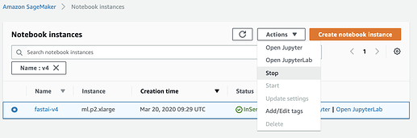

# Amazon SageMaker

このページは、サンプルコードをAmazon SageMakerで実行するための簡単なガイドを提供する。ここでは、読者がすでにAWSのアカウントを持っていることを前提とする。もしまだ持っていないなら[このインストラクション](https://aws.amazon.com/premiumsupport/knowledge-center/create-and-activate-aws-account/)に従ってAWSのアカウントを作ってアクティベイトしよう。

ここでは、ノートブックインスタンス、ノートブックのライフサイクル設定、IAMロールなどのSageMaker資源のプロビジョンすべてに[AWS CloudFormation](https://aws.amazon.com/cloudformation/) を用いる。デフォルトでは、*ml.p2.xlarge*のSageMakerノートブックインスタンスを起動する。このインスタンスはNvidia K80 GPU と50 GBのEBSディスクを持つ。

## 価格

デフォルトインスタンスタイプである`ml.p2.xlarge`は1時間あたり$1.26だ。
時間あたりの単価はインスタンスタイプによって異なる。
[利用可能なタイプのリスト](https://aws.amazon.com/sagemaker/pricing/)を確認しよう。
`ml.p2.xlarge`や`ml.p3.2xlarge`インスタンスを利用するには、明示的にリミット値の増加を
[このページ](https://console.aws.amazon.com/support/home#/case/create?issueType=service-limit-increase)から
リクエストする必要がある。
SageMakerタイプのリミット値を選択し、利用したいリージョンを選ぶ。
新しいリミット値として1を選び、記述を追加して右下のボタンからサブミットする。
インスタンスを停止しないといつまでも課金されることになる。

 

## 設定

### SageMakerノートブックインスタンスの作成

1. ここでは[AWS CloudFormation](https://aws.amazon.com/cloudformation/)を用いて[SageMaker Notebook Instance](https://docs.aws.amazon.com/sagemaker/latest/dg/nbi.html)を作成し、コースのエクササイズを実行するためのJupyter環境を構築する。CloudFormationスタックを起動するには、下のテーブルから最寄りのリージョンを選び「Launch Stack」リンクをクリックすれば良い。

    リージョン | 名前 | 起動リンク
    --- | --- | ---
    US West (Oregon) Region | us-west-2 | 
    US East (N. Virginia) Region | us-east-1 | 
    US East (Ohio) Region | us-east-2 | 
    US West (N. California) Region | us-west-1 |     
    Asia Pacific (Tokyo) Region | ap-northeast-1 | 
    Asia Pacific (Seoul) Region | ap-northeast-2 | 
    Asia Pacific (Sydney) Region | ap-southeast-2 | 
    Asia Pacific (Mumbai) Region | ap-south-1 |  
    Asia Pacific (Singapore) Region | ap-southeast-1 |            
    Canada (central) Region | ca-central-1 |        
    EU (Ireland) Region | eu-west-1 | 
    EU (Frankfurt) Region | eu-central-1 | 
    EU (London) Region | eu-west-2 |     

1. すると下図のようにAWS CloudFormationのWebコンソールがオープンし、AWS資源を構築するためのテンプレートが表示される。入力パラメータをチェックし、必要に応じて変更する。**I acknowledge that AWS CloudFormation might create IAM resources.** 
と書かれたチェックボックスをチェックし、**Create** ボタンをクリックしてスタックを作成する。

    

1. CloudFormationのページが開く。スタックのステイタスは`CREATE_IN_PROGRESS`となっているはずだ。ステイタスが**CREATE_COMPLETE**になるまで待つ。AWSのWebコンソールの左上隅にあるServicesメニューから"sage"と入力すると、下図のように`Amazon SageMaker`のリンクが出てくる。これをクリックしてSageMakerのWebコンソールを開く。

   

1. 左側のナビゲーションバーから、「Notebook instances」を選択する。このページから、ノートブックのインスタンスを作成し管理しアクセスする。下図を見ると、**fastai-v4** という名前のノートブックインスタンスのステイタスが、`InService`となっていることがわかる。

   
   
   最初にノートブックインスタンスを作成する際には、fastaiライブラリと依存するライブラリがインストールされるので、10分程度かかる。
      
### fastaiコース教材の利用

`Open Jupyter`リンクをクリックすると、fastaiコースのノートブックがすでにインストールされたJupyterノートブックのWebインターフェイスへとリダイレクトされる。

ノートブックを最初にオープンする際には、Jupyterに用いるカーネルを選択するように求められる。下図に示すように`fastai`という名前のカーネルがあるので、ドロップダウンメニューからそれを選んで、`Set Kernel`のボタンをクリックする。

`fastai`というカーネルが現れない場合には、依存ライブラリやfastaiライブラリのインストールがまだ終わっていない。完了までには10分かかるので、それを待ってからページをリフレッシュして、`fastai`カーネルを選択しよう。

### インスタンスの停止

- 利用が終わったらノートブックタブをクローズし、**stopをクリックすることを忘れないように！** *stop*ボタンがクリックされるまで、課金が発生し続ける。

    

### 作業の再開

ノートブックを使った演習に戻りたければ、ノートブックインスタンスを選択しStartを選択すればいい。数分まってから前回やったところまで戻れば良い。fastaiライブラリはすでにインストールされているし、ノートブックもセーブされているはずなので、初めて実行するときよりも早いはずだ。

## 質問があったら

コースの内容に質問や疑問があれば、[fast.ai forum](http://forums.fast.ai/)にポストしてほしい。
